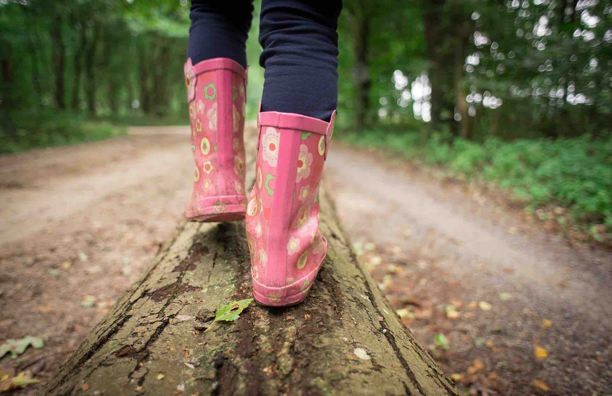

<link rel="stylesheet" href="styles.css" type="text/css">

Born in Uruguay, I came to the UK in 2005 after winning the first [Sanger Institute Prize Competition](https://www.sanger.ac.uk/about/study/sanger-institute-prize-competition) with an assay entitled **The Role of Genomics in the developing world: present and future**. (You can read the [original entry](files/sanger_prize_2005.pdf) that I submitted to the competition, with its typos and everything!). The award was a paid summer internship, which I undertook at the then _Caenorhabditis elegans_ team led by Dr Andrew Fraser. The original 3-months internship got extended to a 6-month and at the end of this, I was encouraged to apply for the Sanger PhD program. To my good luck, I was awarded the full scholarship and started my PhD traning in October 2007 under the supervision of Dr Matt Berriman at the [Parasite Genomics](https://www.sanger.ac.uk/science/groups/berriman-group) team. I was also very lucky to be part of the Schistosomiasis Research Group, then led by Prof David W Dunne and currelty led by Dr Shona Wilson. Almost all the parasitology I know, I learnt it from them.

During my PhD training, I looked at changes in gene expression in the parasite _Schistosoma mansoni_ across various steps in its very complex life cycle. In particular, I was interested (and still am!) in the changes happening just after the parasite enters the mammalian (very often human) host. 
