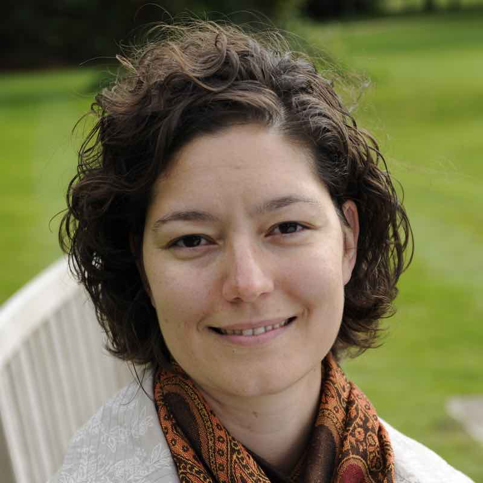

<link rel="stylesheet" href="styles.css" type="text/css">

I like to analyse data to answer research questions and test hypotheses. Currently I investigate questions related to Transposable Elements in Parasites. I am a [Research Group Leader in Computational Biology](https://www.path.cam.ac.uk/directory/anna-protasio) at the [Department of Pathology](https://www.path.cam.ac.uk/), University of Cambridge, in the United Kingdom. 

I hold a PhD in Molecular Biology from the __University of Cambridge__ (Christ's College) and the **Wellcome Sanger Institute** and a BSc in Biochemistry from the __Universidad de la Republica__, Uruguay. During my PhD training, I specialised in the analysis of gene expression using next generation sequencing technologies. Without knowing it, I was becoming a bioinformatician with a passion for parasitology. 

My full CV is available [here](files/CV_generic.pdf).
