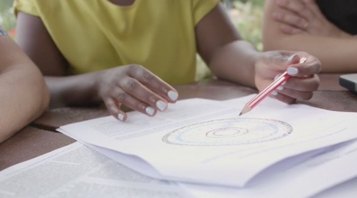

--- 

<link rel="stylesheet" href="styles.css" type="text/css">

 

Many people have helped me in my career and I want to be able to help you in yours. At the moment, my group cannot provide funding for students or postdocs (I am working on that though!). Having a training position within my group will help you gain experience in computational biology, bioinformatics, molecular and systems biology and parasitology. 

As a graduate student in my group, you will have to apply for [Graduate Admission](https://www.graduate.study.cam.ac.uk/courses/directory/blpampbsc) through the University's portal. Funding opportunitites are listed [here](https://www.graduate.study.cam.ac.uk/finance/funding-opportunities).

Some examples of available topics and the skills you will develop are:

- Repeat content of genomes
  - finding repeats and transposable elements in genomes 
  - genome organisation
  - phylogeny and classification
  - expression and mechanisms of control

- Differential gene expression analyses
  - access next generation sequencing data from the web
  - quantification of gene expression
  - comparative analysis
  - time series
  
- Skills
  - bash/shell scripting
  - Perl/Python
  - R, RStudio
  
My main focus is on the **genomics and molecular biology of parasites** but I am open to work on other organisms if there is an interesting biological research question. For example, my group has ongoing collaborations where we look at:
- expression of transposable elements in human cancers
- co-option of transposable element genes into nematode "host" genes
- dynamics of transposable elements in avian malaria

If still interested, do [get in touch](mailto:avp25@cam.ac.uk) ... there is much data to be analysed!

&nbsp;

### Testimonials

_I’ve enjoyed my summer project so much! As a medical student, I hadn’t had a huge amount of previous exposure to computational biology besides my Part II project, so was initially a little nervous about whether I’d be able to manage as a beginner. However, this worry proved unfounded, as the start of the project involved gentle introductions to the programming language and I was soon able to get started on the analysis! I have learnt so much in such a short space of time, and thanks to the wonderful supervision I received my confidence and independence in using computational methods has really grown. I’m hoping to take what I have learnt forward into the future, perhaps by doing further research projects in this vein alongside clinical training. Overall, I would recommend the experience to anyone who wants to learn a valuable new skill whilst seeing another side of biological research!_ 

[Ramya (medical student, August 2020)]{style="float:right"}

