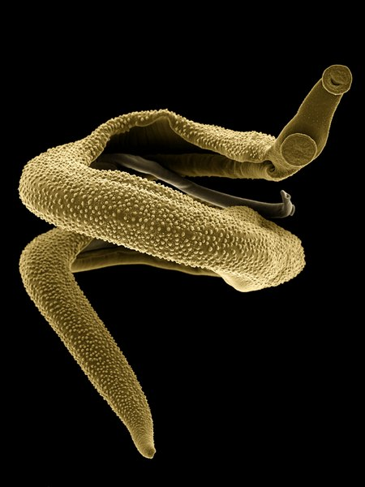

### Summary

Transposable elements (TEs) are mobile genetic entities that exist in almost all genomes. They constitute almost 50% of the human genome and have a life cycle very similar to that of viruses, with the exception that they rarely exit the cell. Instead, TEs replicate and insert themselves in the genome, potentially disrupting the normal function of the cell. Because of their self-replicating capacity TEs are often considered invaders and even parasites of the “host” genome.

I am interested in investigating the mechanisms by which the ‘host genome’ controls the activity of these TEs. This can be imagined as a sort of arms race, where TEs and the host genome fight for the genomic space. My work involves using computational biology tools (bioinformatics) to integrate data from genomes, next generation sequencing, RNA biology and more with the aim of understanding how these mechanisms have evolved in species of parasitic flatworms of clinical and veterinary importance.

<figure style="width: 30%">
  

  <figcaption>Pair of schistosomes _in copula_. Credit: [Jana Bulantová](https://commons.wikimedia.org/wiki/File:20_Schistosoma_mansoni.tif) / CC BY-SA</figcaption>
</figure>

Parasitic flatworms also known as helminths are fantastic animals that have co-evolved with their human and other animal hosts maximising the parasitic relationship. My favourite parasites are _Schistosomes_, you can see a pair of these worms on the right. The chunky more bulky adult male, covered in spines, embraces the more slender female. Schistosomes are the causative agents of a pathology known as schistosomiasis or bilharzia and affects millions of people in the poorest countries.  

### In depth

Maintenance of genome integrity is an essential aspect of biology for all organisms. Mobile genetic elements, also known as transposable elements (TEs), are self-replicating entities found in almost all known genomes. Because of their autonomous and invasive nature, TEs have historically been referred to as ‘genomic parasites’ and the genome they colonised referred to as the ‘host genome’. The extent of invasion can be so dramatic that in some animal species, including humans and most parasitic flatworms, nearly 50% of the genome is occupied by TEs. Movement of TEs can be deleterious to the host organism; for example, a new TE insertion within an essential gene may cause disease (e.g. certain cases of haemophilia); however, not all TE activity is detrimental. Growing evidence points to the role of TEs in shaping the evolution of genomes and regulation of gene expression networks. For example, the appearance of placental mammals is linked to the ‘domestication’ of a TE gene. Therefore, a more modern approach conceives of TEs as potential endosymbionts of their host genomes.

In order to control the activity of TEs, organisms from plants to humans have developed elegant molecular mechanisms to tame these self-interested entities. There are two main strategies by which the host genome can exert control of TEs: epigenetic and post-transcriptional. Epigenetic control relies on DNA and/or histone modifications at the TE genomic locus, leading to suppression of activity. Post-transcriptional control involves targeted degradation of the RNA intermediate required by the TE to undergo replication. The host genome takes advantage of this characteristic and mounts an RNA interference (RNAi)-like mechanism that prevents TE replication by degrading the TE RNA intermediate.

<figure style="width: 50%; float:left; margin-right: 20px">
  

  <figcaption>Schematic representation of two known post-transcriptional mechanisms of TE control in model organisms </figcaption>
</figure>

This is a highly conserved function but the molecular mechanisms used to implement it vary greatly across the tree of life, indicating independent evolutionary origins. Despite this, there are two elements common to all these pathways: **small RNAs** (~ 20-30nt long) with sequence complementarity to nascent TE transcripts that drive slicer enzymes from the **Argonaute** family to trigger TE RNA degradation (Figure). The origin of these small RNAs can vary among species: in the classical example of the mouse and human male germline, a particular type of small RNAs called piwi-RNAs (piRNAs) are transcribed from genomic clusters and loaded into a special group of Argonaute proteins called PIWI proteins. The PIWI-piRNA complex then degrades the TE RNA intermediates and in doing so prevents TE re-insertion in the genome. In other examples, an auxiliary enzyme called Dicer produces Argonaute-ready small RNAs from a double stranded RNA (dsRNA). Organisms including Caenorhabditis elegans and some plants, convert single stranded RNA (ssRNA) into dsRNA using an RNA-dependent RNA-polymerase (RDRP). 

Parasitic flatworms lack both the canonical piRNA pathway characterised by PIWI proteins and the RNA-dependent RNA-polymerase ubiquitous in species in which the piRNA pathway is absent. They do have a set of Dicer and Argonaute enzymes suggesting that some key players of the post-transcriptional control of TEs are present. In particular, flatworm Argonautes are phylogenetically distinct from model organism Argonautes and PIWI proteins. They are also found in very low numbers: parasitic flatworms only have three Argonaute proteins while nematodes have more than twenty. Parasitic flatworms present an exciting opportunity to uncover novel molecular pathways for post-transcriptional TE control.